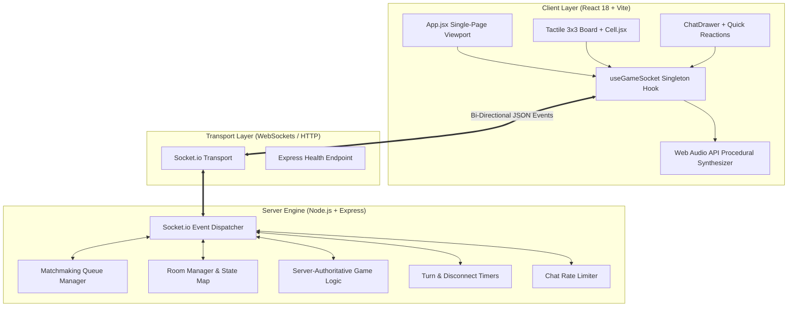
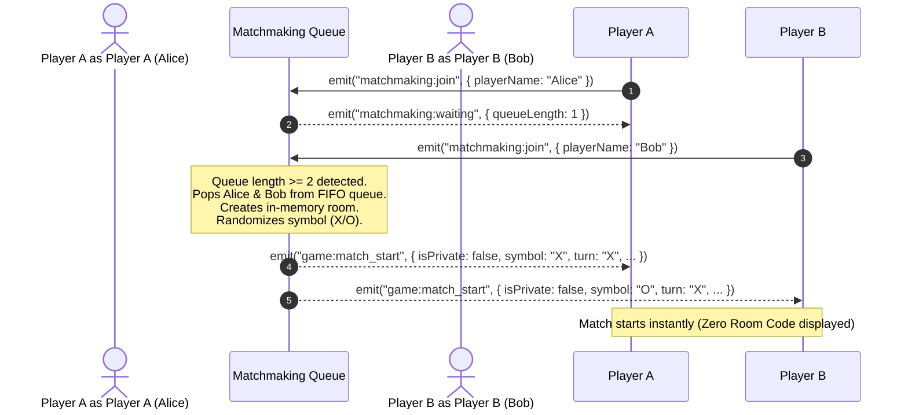
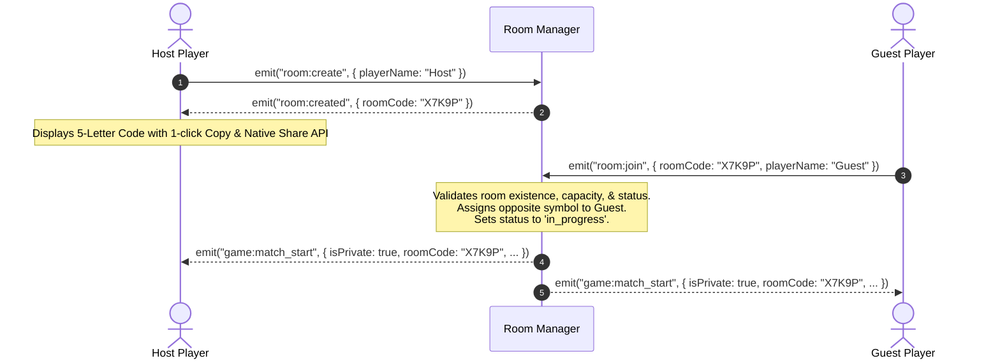
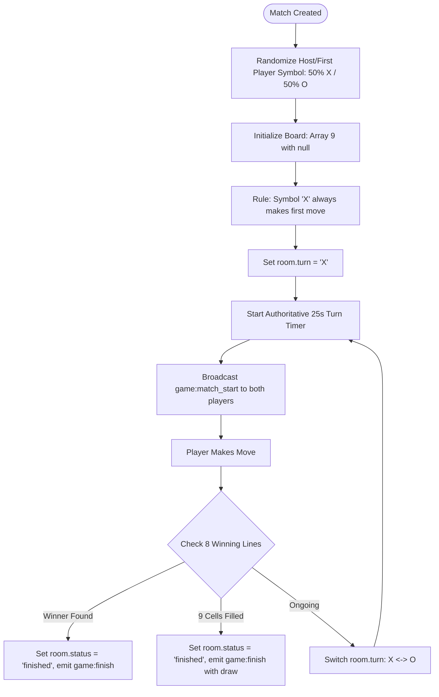
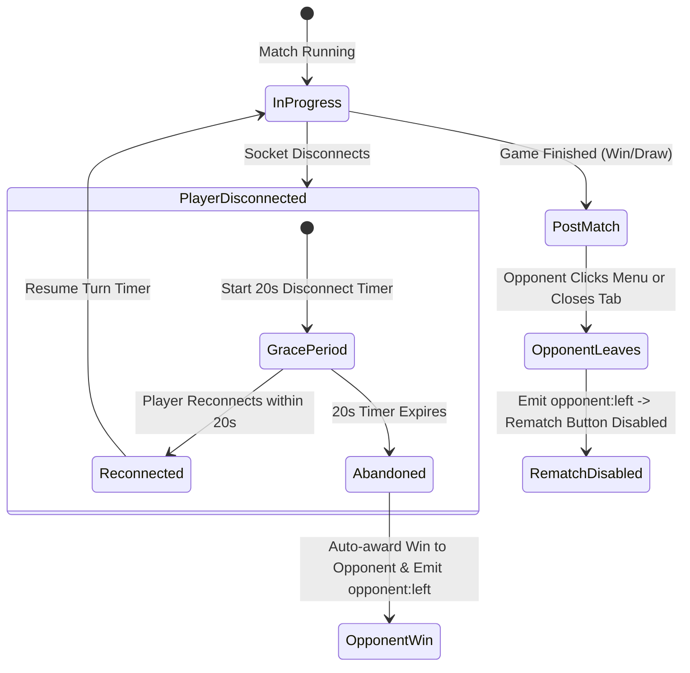
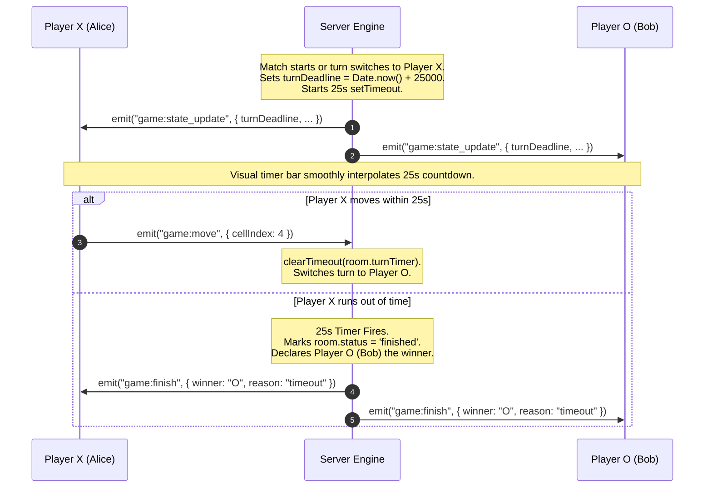
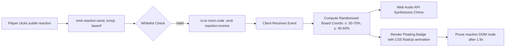
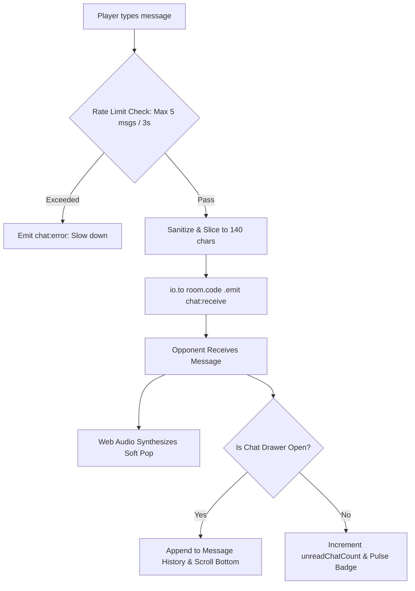
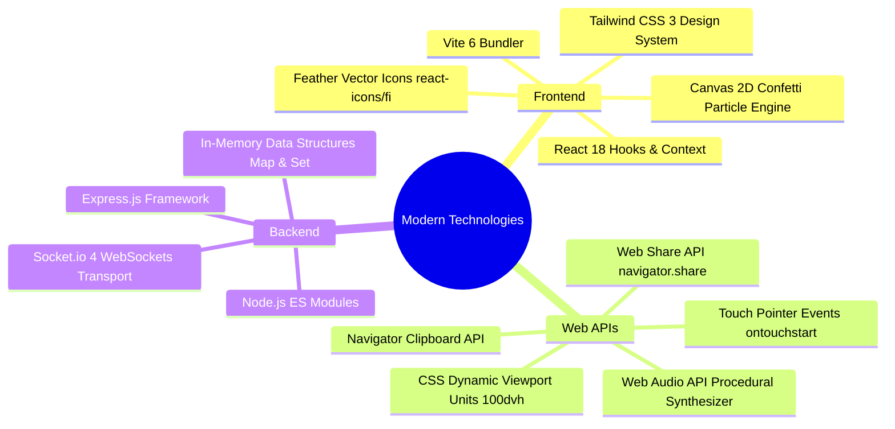

# Real-Time Tic-Tac-Toe Arena (Architecture & Technical Documentation)

A high-performance, anonymous, real-time multiplayer Tic-Tac-Toe platform engineered with a **React 18 frontend**, **Node.js / Express backend**, and **Socket.io real-time engine**. Designed with a soft pastel aesthetic, procedural Web Audio synthesizer, strict server-authoritative game logic, and zero authentication overhead.

---

## 🌐 Live Deployments

- **Live Application (Frontend)**: [https://realtime-tic-tac-toe.vercel.app](https://realtime-tic-tac-toe.vercel.app/)
- **Live Backend Engine (Render)**: [https://realtime-tic-tac-toe-73lu.onrender.com](https://realtime-tic-tac-toe-73lu.onrender.com)
- **Health Check Endpoint**: [https://realtime-tic-tac-toe-73lu.onrender.com/health](https://realtime-tic-tac-toe-73lu.onrender.com/health)

---

## Architecture Overview

The system uses an **ephemeral in-memory server-authoritative architecture**. No persistent database, user accounts, or login sessions exist. All matchmaking queues, rooms, turn timers, and rate limiters operate in memory with auto-cleanup upon room disposal.



---

## Architectural Comparison: Legacy vs. Modern Engine

| Dimension           | Legacy Implementation                                                     | Modern Upgraded Architecture                                                                                              |
| :------------------ | :------------------------------------------------------------------------ | :------------------------------------------------------------------------------------------------------------------------ |
| **Matchmaking**     | Leaked Room IDs across all modes; public games printed private room codes | Strict separation: **Global Matchmaking** is 100% queue-based (zero codes); **Private Rooms** use 5-letter codes          |
| **Game Authority**  | Weak client-side move handling; turn races possible                       | **Strict server-authoritative** validation (coordinates, turns, board state, winning patterns)                            |
| **Chat & SDKs**     | Heavy 3rd-party Stream Chat SDK with cookies & bloat                      | Lightweight, custom Socket.io rate-limited broadcast with unread counter                                                  |
| **Audio**           | Static external audio assets (or none)                                    | **Zero-asset Web Audio API** procedural sound synthesizer                                                                 |
| **Disconnection**   | Abrupt terminations; no reconnection windows                              | **20-second grace period** with countdown banner + auto-abandonment fallback                                              |
| **Post-Game Exit**  | Opponent exit left other player stuck on waiting rematch                  | Immediate `opponent:left` event disabling the Rematch button on the other client                                          |
| **Design / Layout** | Generic neon/dark theme with page scrollbars                              | **Soft pastel aesthetic**, tactile 3D elements, subtle Feather icons, **strict 100dvh single-page non-scrollable layout** |

---

## 1. Global Matchmaking & Opponent Discovery

Global Matchmaking connects any two available online players automatically without room codes or manual setup.



### Implementation Details:

1. **FIFO In-Memory Queue**: `matchmaking.js` maintains an array of queued socket objects: `{ socketId, playerName, joinedAt }`.
2. **Duplicate Socket Pruning**: Sockets already queued or in existing games are automatically pruned before queue insertion.
3. **Zero Room ID Leakage**: The server sets `isPrivate: false`. The frontend suppresses all room code displays, rendering a clean `Quick Match` indicator.

---

## 2. Room-Based Matchmaking (Private Rooms)

For playing with a friend across devices, the Private Room system uses a 5-letter alphanumeric code.



### Implementation Details:

- **Unambiguous Character Set**: `ROOM_CHARACTERS = 'ABCDEFGHJKLMNPQRSTUVWXYZ23456789'` (excludes easily confused glyphs like `0`, `O`, `1`, `I`).
- **Validation**: Rejects expired, full, or non-existent rooms with user-friendly error banners.

---

## 3. First Turn Selection & Board State Management



### Rematch State & Symbol Inversion:

When both players accept a rematch:

- The server inverts symbols: `p1.symbol = p1.symbol === 'X' ? 'O' : 'X'`.
- This ensures player fairness across multi-game rounds.
- The board resets to `Array(9).fill(null)` and the starter alternates.

---

## 4. Disconnection Detection & Room Abandonment



### Disconnection Rules:

1. **Active Match Disconnect**: A 20-second grace period is triggered (`GAME_CONFIG.DISCONNECT_GRACE_MS = 20000`). The active player sees a soft warning banner with a live countdown.
2. **Post-Match Exit**: If a match is finished and one player leaves or disconnects, the server immediately emits `opponent:left`.
3. **Disabled Rematch Button**: The remaining player's client receives `opponent:left`, resets any pending rematch requests, and renders a disabled Rematch button (`"Rematch (Opponent Left)"`) with an informative notification.

---

## 5. Precision Situations & Race Condition Prevention

| Edge Case / Precision Situation        | Technical Solution                                                                                                                                                  |
| :------------------------------------- | :------------------------------------------------------------------------------------------------------------------------------------------------------------------ |
| **Simultaneous Move Attempts**         | Moves are validated server-side against authoritative `room.turn`. If Player O sends a move during Player X's turn, the server rejects it with `game:invalid_move`. |
| **Network Lag / Out-of-Order Packets** | Moves check cell occupancy (`board[index] === null`). Once a cell is claimed on the server, duplicate moves on that index are discarded.                            |
| **Mobile Touchscreen Misclicks**       | **Two-stage tap confirmation**: First tap highlights the cell with a dashed pastel indicator and symbol preview; second tap on the same cell submits the move.      |
| **Desktop Hover Feedback**             | Pointer hover displays a semi-transparent ghost preview of the active player's symbol.                                                                              |
| **Rapid Button Spamming**              | Buttons implement pointer event throttling and automatic disabled attributes during async socket transitions.                                                       |

---

## 6. Turn Timeouts & Server Authoritative Expiry

To prevent games from stalling indefinitely when a player is idle:



---

## 7. Subtle In-Game Reactions & Procedural Board Placement

Players can send subtle reactions (`thumbs-up`, `heart`, `award`, `smile`, `zap`, `star`) during a match.



---

## 8. Optimized Chat Architecture & Unseen Message Counter

The real-time match chat is designed for high efficiency with zero external cloud dependencies.



### Key Efficiency Highlights:

- **No Third-Party SDKs**: Replaced heavy external chat providers with a native, zero-latency Socket.io transport.
- **In-Memory Rate Limiting**: Per-socket token bucket map prevents spam attacks.
- **Unread Counter**: State tracks unread messages while the drawer is closed, displaying a notification badge with the exact count. Opening the drawer automatically clears the count.

---

## 9. Visual Aesthetics, UX Polish & Enhancements

1. **Soft Pastel Aesthetic**: Curated color palette (Cotton Candy Pink `#f472b6`, Sky Blue `#38bdf8`, Mint Green `#34d399`, Lavender `#c084fc`, Sunny Yellow `#fbbf24`) with tactile 3D border-offset buttons.
2. **Zero Emojis**: 100% clean SVG vector iconography using `react-icons/fi` (Feather Icons).
3. **Animated Marker Strike Line**: Procedural SVG gradient stroke with `@keyframes drawMarkerStroke` that draws across the winning 3-in-a-row line upon victory.
4. **Single-Page Non-Scrollable Layout**: Configured with `h-screen max-h-screen overflow-hidden` and `100dvh` support to guarantee a fit on mobile, tablet, and desktop screens without vertical scrolling.
5. **Confetti Celebration Engine**: Lightweight full-screen canvas particle explosion on match victory.

---

## 10. Modern Technologies & Web APIs Used



### Web Audio API Synthesizer (Zero Assets):

Sound effects are procedurally generated on the fly via `AudioContext`:

- **Click**: Short sine tone (600Hz -> 300Hz, 40ms)
- **Move (X)**: Crisp rising chime (520Hz -> 780Hz, 80ms)
- **Move (O)**: Warm descending chime (660Hz -> 440Hz, 80ms)
- **Victory**: 3-note harmonic major chord arpeggio (C5 -> E5 -> G5)
- **Draw**: Neutral dual-frequency interval (350Hz + 370Hz)
- **Loss**: Gentle downward low-frequency sweep (320Hz -> 180Hz)

---

## Project Structure

```text
├── server/
│   ├── config.js              # Environment, port, CORS, & timeout configs
│   ├── server.js              # Express app + Socket.io bootstrap & health endpoint
│   ├── src/
│   │   ├── gameLogic.js       # Pure board evaluation & win checking
│   │   ├── matchmaking.js     # Global FIFO queue & player pairing
│   │   ├── roomManager.js     # Room Map, 5-letter code generator, player mappings
│   │   └── socketHandlers.js  # Socket.io event router, turn timers, & rate limiter
│   ├── test_integration.js    # 7-point integration test suite
│   └── test_opponent_leaves.js# Rematch disable verification test
│
└── tictactoe/
    ├── index.html             # 100dvh viewport configuration & fonts
    ├── src/
    │   ├── App.jsx            # Main view manager & single-page layout
    │   ├── index.css          # Pastel design system, animations, & viewport rules
    │   ├── components/
    │   │   ├── audio/         # Sound toggle component
    │   │   ├── board/         # Board.jsx, Cell.jsx, WinningLine.jsx
    │   │   ├── chat/          # ChatDrawer.jsx, ChatMessage.jsx, QuickReactions.jsx
    │   │   ├── common/        # Confetti.jsx, Toast.jsx
    │   │   ├── game/          # PlayerCard.jsx, GameOverModal.jsx, DisconnectBanner.jsx
    │   │   └── lobby/         # ModeSelector.jsx, MatchmakingModal.jsx, PrivateRoomModal.jsx, LocalSetupModal.jsx
    │   ├── hooks/
    │   │   ├── useGameSocket.js # Online multiplayer socket controller
    │   │   └── useLocalGame.js  # Offline 2-player controller
    │   ├── services/
    │   │   ├── audioService.js  # Web Audio API synthesizer
    │   │   └── socket.js        # Resilient Socket.io singleton
    │   └── utils/
    │       └── gameUtils.js     # Coordinate calculations for winning line strike
```

---

## Running Locally

### 1. Start Backend Server

```bash
cd server
npm install
npm start
# Server listens on http://localhost:3000
```

### 2. Start Frontend App

```bash
cd tictactoe
npm install
npm run dev
# App opens on http://localhost:5173
```

### 3. Run Automated Integration Tests

```bash
# Run against local server
cd server
node test_integration.js

# Or run directly against live Render deployment
$env:TEST_SERVER_URL="https://realtime-tic-tac-toe-73lu.onrender.com" # PowerShell
node test_integration.js
```

---

## 🚀 Deployment Configuration

### Frontend (Vercel)
- **Framework**: Vite
- **Root Directory**: `tictactoe`
- **Build Command**: `npm run build`
- **Output Directory**: `dist`
- **Environment Variables**:
  - `VITE_SERVER_URL`: `https://realtime-tic-tac-toe-73lu.onrender.com`

### Backend (Render)
- **Environment**: Node
- **Root Directory**: `server`
- **Build Command**: `npm install`
- **Start Command**: `npm start`
- **Environment Variables**:
  - `PORT`: `3000` (or dynamically allocated by Render)
  - `CLIENT_URL`: `http://localhost:5173,https://realtime-tic-tac-toe.vercel.app`

